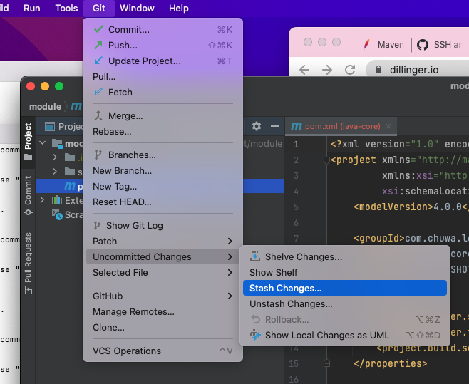

# Learn MarkDown

1. Learn **MarkDown** and show all of basic usage in the **ShortQuestions/README.md**
    1. https://docs.github.com/en/get-started/writing-on-github/getting-started-with-writing-and-formatting-on-github/basic-writing-and-formatting-syntax
1. practice git using the platform. list the git commands you learned
    1. https://learngitbranching.js.org/
3. What is the basic steps to init a git repo in you local ?
    - create a new directory to host the repo.
    - `cd` to the directory.
    - run `git clone` to clone the repository to local, or `git init` to initiate the local repository.
4. How to clone a repo from Github ?
    - run command `git clone {repository_address}`.
5. How to create a new branch and checkout to that branch ?
    - option 1: run command `git checkout -b {branch_name}`.
    - option 2: run command
        ```
        git branch {branch_name}
        git checkout {branch_name}
        ```
6. How to merge the branch_test to master branch in command ? show me the commands
    ```
    git checkout master
    git merge branch_test 
    ```
7. How to **stash** your new code before leaving branch **branch_learn_stash** and pop your stash when you checkout back to **branch_learn_stash ? try commands way and intellij way.
    - commands
        ```
        git stash // stash current work
        git stash list // list all the stashes
        git stash pop // recover the most recent stash
        git stash pop {stash-name} // recover the specific stash
        ```
    - intellij: see 
8. How do you understand **PR is based on Branch**?
    - PR means pull request, which meant to make a request for merging the source branch, which contains a couple commits, into the target branch on the repository.
9. What is maven role ? what it be used to do ?
    - maven role
        - manage dependencies
        - build project
        - documentation
        - reporting
    - Use maven is easy to download add and remove the dependencies/libraries.
10. What is the lifecycle of maven? could you tell me the details ?
    - Clean -> prepare-resources -> validate -> package -> install
        |Phase|Handles|Description|
        |---|----|---|
        prepare-resources| resource copying| Resource copying can be customized in this phase.
        |validate| Validating the information|Validates if the project is correct and if all necessary information is available.|
        |compile| compilation| Source code compilation is done in this phase.|
        |Test| Testing| Tests the compiled source code suitable for testing framework.|
        |package| packaging| This phase creates the JAR/WAR package as mentioned in the packaging in POM.xml.|
        |install| installation| This phase installs the package in local/remote maven repository.|
        |Deploy| Deploying| Copies the final package to the remote repository|
11. what is the difference between **package** and **install** in maven lifecycle ?
    - **package** creates the JAR/WAR package, but **install** installs the package.
12. What is plugins in maven, list some plugins.
    - There are many plugins available, such as clean, compiler, deploy, and etc. See details at [Maven Project Plugins](https://maven.apache.org/plugins/index.html).
13. In **chuwa0808**, **MavenProject** directory, create a maven Module using Intellij, named it as belows:
    1. groupID: com.chuwa.learn
    2. artifactID: java-core
14. Do Code Review: Go over the PRs in your repo, tried to leave some useful or useful comments in other students' PR, please **don't** merge it.


