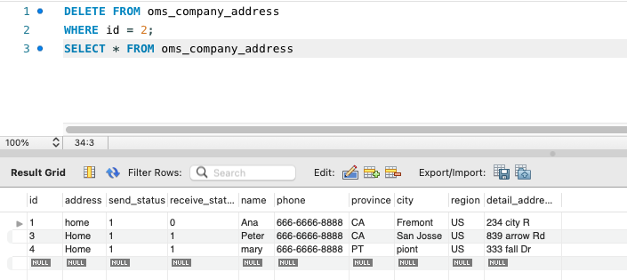
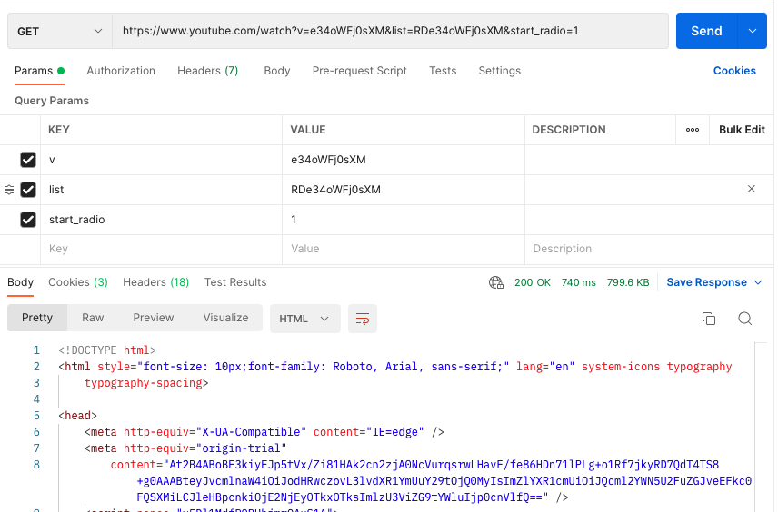
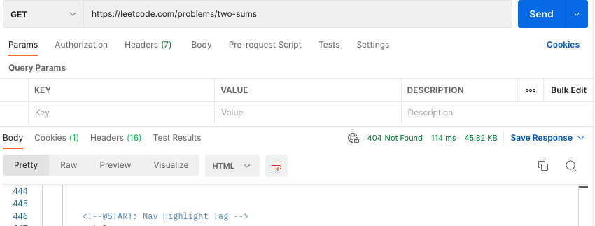

# Homework 5

 ## Database

CRUD MySQL and MongoDB

1. Create `oms_company_address` table
   - See HW5_1/exercise.csv
2. Insert some random data to `oms_company_address` table
   - See HW5-1/exercise.csv
   - 
3. Write a SQL query to fetch all data from `oms_company_address` table
   - using command
   - SELECT * FROM `Practice DB`.oms_company_address;
   - Get all data from table
4. Write a SQL query to fetch top 3 records from `oms_company_address` table
   - Using command
   - SELECT  * FROM oms_company_address 
     LIMIT 3;
   - Get top 3 rows data.
   - 
5. Update `oms_company_address` table to set all `phone`to 666-6666-8888
   - UPDATE oms_company_address
     SET phone = "666-6666-8888";
   - 
6. Delete one entry from `oms_company_address` table
   - using command
   - DELETE FROM oms_company_address
     WHERE id = 2;
   - Delete id = 2 entry.
   - 
7. (Optional) You can also try to create other tables that listed above

## REST API  

### Postman  

take below examples, 
5 GET APIs with different response type
5 Post API with json request body, please also paste the response here
3 PUT API with json request body, please also paste the response here
2 DELETE API
Each example with 404, 401,500 and any http status codes you know
example:
API-GET-1
API: GET  https://ghibliapi.herokuapp.com/locations
API POST {{base_url}}/v2/checkout/orders
RequestBody: N/A, since it is GET

1. GET apis examples

   - ## 200 OK ##

   

   - ## 404 NOT FOUND ##

   - 

   - Try other POST, PUT failed.

     

## API 

1. Find 2 collection of APIs example. ie. Twitter, Paypal, Youtube etc.  -- 命名规范

   - Youtube

     - GET

       - ```
         https://www.googleapis.com/youtube/v3/channels
         ```

     - POST

     - DELETE

   - Twitter

     - GET 
       - https://ads-api.twitter.com/{{version}}/stats/accounts/{{account_id}}/active_entities?
     - POST
       	-  https://ads-api.twitter.com/{{version}}/stats/jobs/accounts/{{account_id}}?end_time=&entity=&entity_ids=&granularity=&metric_groups=&placement=&start_time=
     - DELETE
       - https://ads-api.twitter.com/{{version}}/stats/jobs/accounts/{{account_id}}/:job_id

2. Design a collection of APIS for a Blog Website, please specify GET POST PUT DELETE

   - Api name is : blog.com

   - GET users blog list

     - http://blog.com/users/{id}/bloglists

   - POST create a new blog content

     ​	- http://blog.com/users/{id}/bloglists

   - PUT update users blog content

     - http://blog.com/users/{id}/bloglists/{blogId}

   - DELETE delete a blog

     - http://blog.com/users/{id}/bloglists/{blogId}

