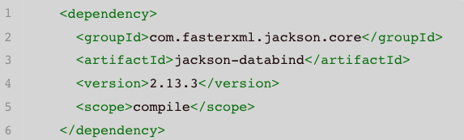
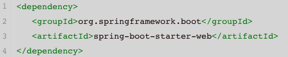

# Homework 8


1. List all of the new annotations to your annotaitons.md and explain its role.
  - see ShortQuestions/annotations

2. how do you do the debug?

   - Read the stack traces
   - Google the questions
   - Ask someone for help
   - Write unit tests

3. What is DTO, VO, Payload, DO?

    - DTO basically stands for Data Transfer Object. It encapsulates values to carry data between processes or networks. formerly known as value objects or VO, is a design pattern used to transfer data between software application subsystems. DTOs are often used in conjunction with data access objects to retrieve data from a database.

    - VO known as the value object, A Value Object's identity is based on their state rather than on their object identity and is immutable. A real world example would be Color.RED, Color.BLUE, SEX.FEMALE etc. 

    - DTO: "Data transfer objects " can travel between seperate layers in software architecture. 

       VO: "Value objects " hold a object such as Integer,Money etc. 

    - DAO Data Access Object is design pattern just provide an interface for accessing data to service layer and provide different implementations for different data sources (Databases, File systems), responsible for CRUD operations.

    - DO: Data/Domain Object

    - The payload contains the data that could be stored or updated.

    - The difference between data transfer objects and business objects or data access objects is that a DTO does not have any behaviour except for storage and retrieval of its own data (accessors and mutators).

4. What is @JsonProperty("description_yyds")?

  - The @JsonProperty annotation is **used to map property names with JSON keys during serialization and deserialization**. 

5. do you know what is jackson?

  - Jackson is a very popular and efficient java based library to serialize or map java objects to JSON and vice versa.

  

6. What is spring-boot-stater? 
  - Spring Boot Starters are dependency descriptors that can be added under the **<dependencies>** section in pom.xml. There are around 50+ Spring Boot Starters for different Spring and related technologies. These starters give all the dependencies under a single name. For example, if you want to use Spring Data JPA for database access, you can include **spring-boot-starter-data-jpa** dependency. 

  - The advantages of using Starters are as follows:
    - Increase productivity by decreasing the Configuration time for developers.
    - Managing the POM is easier since the number of dependencies to be added is decreased.
    -  Tested, Production-ready**,** and supported dependency configurations.
    -  No need to remember the name and version of the dependencies.
  
  -  what dependecies in the below starter? do you know any starters?

- Spring boot starter web dependecy
- Spring Boot Application Starters

| Name                                            | Description                                                  |
          | ----------------------------------------------- | ------------------------------------------------------------ |
          | **spring-boot-starter**                         | Core starter, including auto-configuration support, logging, and YAML |
          | **spring-boot-starter-activemq**                | Starter for JMS messaging using Apache ActiveMQ              |
          | **spring-boot-starter-amqp**                    | Starter for using Spring AMQP and Rabbit MQ                  |
          | **spring-boot-starter-aop**                     | Starter for aspect-oriented programming with Spring AOP and AspectJ |
          | **spring-boot-starter-artemis**                 | Starter for JMS messaging using Apache Artemis               |
          | **spring-boot-starter-batch**                   | Starter for using Spring Batch                               |
          | **spring-boot-starter-cache**                   | Starter for using Spring Framework’s caching support         |
          | **spring-boot-starter-data-cassandra**          | Starter for using Cassandra distributed database and Spring Data Cassandra |
          | **spring-boot-starter-data-cassandra-reactive** | Starter for using Cassandra distributed database and Spring Data Cassandra Reactive |
          | **spring-boot-starter-data-couchbase**          | Starter for using Couchbase document-oriented database and Spring Data Couchbase |
          | **spring-boot-starter-data-couchbase-reactive** | Starter for using Couchbase document-oriented database and Spring Data Couchbase Reactive |
          | **spring-boot-starter-data-elasticsearch**      | Starter for using Elasticsearch search and analytics engine and Spring Data Elasticsearch |
          | **spring-boot-starter-data-jdbc**               | Starter for using Spring Data JDBC                           |
          | **spring-boot-starter-data-jpa**                | Starter for using Spring Data JPA with Hibernate             |
          | **spring-boot-starter-data-ldap**               | Starter for using Spring Data LDAP                           |
          | **spring-boot-starter-data-mongodb**            | Starter for using MongoDB document-oriented database and Spring Data MongoDB |
          | **spring-boot-starter-data-mongodb-reactive**   | Starter for using MongoDB document-oriented database and Spring Data MongoDB Reactive |
          | **spring-boot-starter-data-neo4j**              | Starter for using Neo4j graph database and Spring Data Neo4j |
          | **spring-boot-starter-data-r2dbc**              | Starter for using Spring Data R2DBC                          |
- Spring Boot Production Starters

| Name                             | Description                                                  |
| -------------------------------- | ------------------------------------------------------------ |
| **spring-boot-starter-actuator** | Starter for using Spring Boot’s Actuator which provides production-ready features to help you monitor and manage your application |

- Spring Boot Technical Starters

| Name                                  | Description                                                  |
      | ------------------------------------- | ------------------------------------------------------------ |
      | **spring-boot-starter-jetty**         | Starter for using Jetty as the embedded servlet container. An alternative to spring-boot-starter-tomcat |
      | **spring-boot-starter-log4j2**        | Starter for using Log4j2 for logging. An alternative to spring-boot-starter-logging |
      | **spring-boot-starter-logging**       | Starter for logging using Logback. Default logging starter   |
      | **spring-boot-starter-reactor-netty** | Starter for using Reactor Netty as the embedded reactive HTTP server. |
      | **spring-boot-starter-tomcat**        | Starter for using Tomcat as the embedded servlet container. Default servlet container starter used by spring-boot-starter-web |
      | **spring-boot-starter-undertow**      | Starter for using Undertow as the embedded servlet container. An alternative to spring-boot-starter-tomcat |

7. do you know  @RequestMapping(value = "/users", method = 
   RequestMethod.POST) ? could you list CRUD by this style?

   - @RequestMapping(Value = "/users", method = RequestMethod.POST)
     - Value = URL Path, this method is POST operation.
   - @RequestMapping(method = RequestMethod.POST)
   - @RequestMapping(value = "/{id}", method = RequestMethod.GET)
   - @RequestMapping(value = "/{version}", method = RequestMethod.PUT)
   - @RequestMapping(value = "/{id}", method = RequestMethod.Delete)

8. What is ResponseEntity? why do we need it?

    - ResponseEntity represents the whole HTTP response: status code, headers, and body. As a result, we can use it to fully configure the HTTP response.

    

9. What is ResultSet in jdbc? and describe the flow how to get data using JDBC

    - The SQL statements that read data from a database query, return the data in a result set. The SELECT statement is the standard way to select rows from a database and view them in a result set. The *java.sql.ResultSet* interface represents the result set of a database query.

      A ResultSet object maintains a cursor that points to the current row in the result set. The term "result set" refers to the row and column data contained in a ResultSet object.

| JDBC connection | Connection Number             |
      | --------------- | ----------------------------- |
      | 1               | Import the package            |
      | 2               | Load and Register the drivers |
      | 3               | Establish the connection      |
      | 4               | Create the statement          |
      | 5               | Execute the statement         |
      | 6               | Process Result                |
      | 7               | Close/terminate               |

10. What is the ORM framework?

    - An object-relational mapper **provides an object-oriented layer between relational databases and object-oriented programming languages without having to write SQL queries**. It standardizes interfaces reducing boilerplate and speeding development time.

11. Learn how to use ObjectMapper by this example.

      - https://github.com/TAIsRich/chuwa-eij-tutorial/blob/main/02-java-core/src/main/java/com/chuwa/exercise/oa/api/FoodOutletJackson.java

12. What is the serialization and desrialization?

     Serialization is a mechanism of converting the state of an object into a byte stream. Deserialization is the reverse process where the byte stream is used to recreate the actual Java object in memory. This mechanism is used to persist the object.

      a. https://hazelcast.com/glossary/serialization/

13. use stream api to get the average of the array [20, 3, 78, 9, 6, 53, 73, 99, 24, 32].

     ``` java
     int[] array = {20, 3, 78, 9, 6, 53, 73, 99, 24, 32};
     double average = Arrays.stream(array)
       .averge()
       .orElse(-1.0)
     ```

14. 抄写，https://github.com/TAIsRich/springboot-redbook/tree/03_post_pageable 你也可以像我一样分branch添加新代码。

15. (Optional) 抄写 https://github.com/TAIsRich/springboot-redbook/tree/04_comment 你也可以像我一样分branch添加新代码。

16. (Optional) Try to write the CRUD api for a new application Cassandra-Blog
        a. spring 提供了相关dependency,(https://start.spring.io/)
            i.  Spring Data for Apache Cassandra
        b. Cassandra十分流行，且面试问的多。