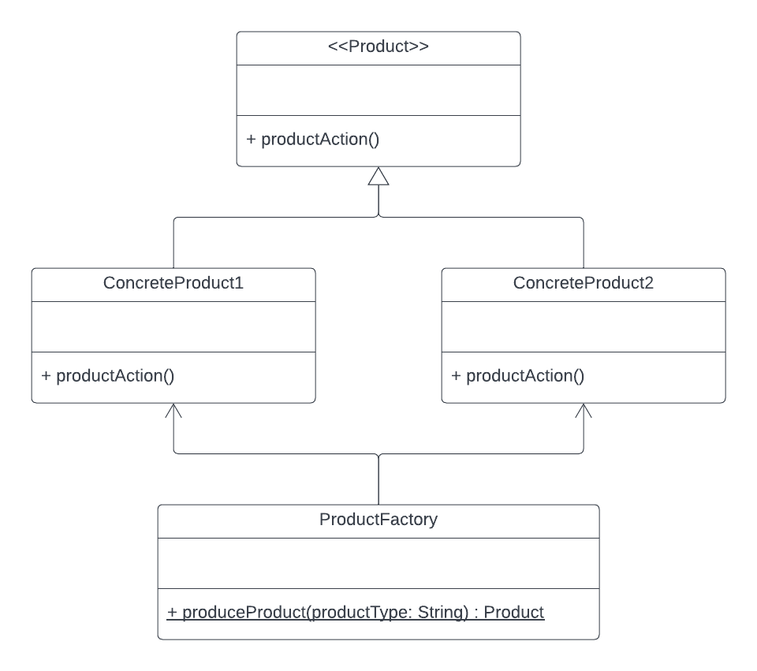

# Design Patterns

### Simple Factory Pattern

1. **What**: 
   - describes a class that has one creation method with a large conditional that based on method parameters chooses which product class to instantiate and then return. People usually confuse simple factories with a general factories or with one of the creational design patterns.
2. **Why**
   - A simple factory is usually represented by a single method in a single class. Over time, this method might become too big, so you may decide to extract parts of the method to subclasses. Once you do it several times, you might discover that the whole thing turned into the classic *factory method* pattern.
3. **Class Diagram**
   - 

4. **Example**

   ``` java
   public interface Product {
     void buildProduct();
   }
   
   public class ConcreteProduct1 implement Product {
     @Override
     void buildProduct() {
       ....
     }
   }
   
   public class ConcreteProduct2 implement Product {
     @Override
     void buildProduct() {
       ....
     }
   }
   
   public class ProductFactory {
     
     public static Product factoryMethod(String type) {
       if (type.equalsIgnoreCase("A")) {
         return new ConcreteProduct1();
       } else if (type.equalsIgnoreCase("B")){
         return new ConcreteProduct2();
       }
     }
   }
   ```

   